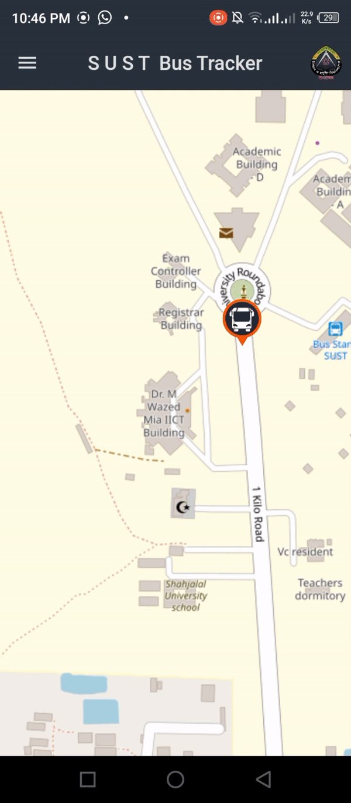
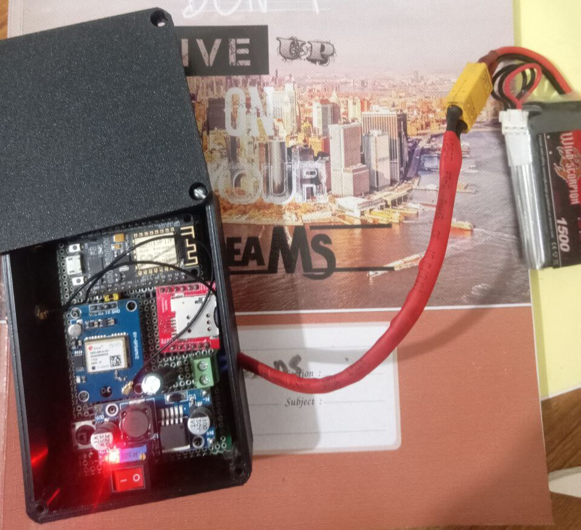

# BUS Kothay (SUST Bus Tracking System)

## Project Overview

The SUST Bus Tracking System is a solution designed to improve the transportation experience for students, teachers, and staff at Shahjalal University of Science and Technology (SUST). With over 40 buses serving the university, it's essential to provide real-time tracking and information to prevent users from missing their rides. This project includes a Flutter app and a hardware setup to track the university's buses.

## Features

- **Real-Time Bus Tracking:** Track the location of SUST buses in real-time to know their exact position.

- **Bus Information:** Access detailed information about each bus, such as its route, estimated arrival time, and current location.

- **User-Friendly Mobile App:** A Flutter app with a user-friendly interface to help students and staff easily access bus tracking information.

- **GPS Integration:** Utilizes a Neo-6M GPS module for accurate bus location tracking.

- **GSM Connectivity:** Uses a SIM800L GSM module for real-time data transmission and updates.

- **Low Latency:** The system provides updates every 5-10 seconds, ensuring accurate and timely information.

- **Efficient Power Management:** Utilizes a buck module to manage and optimize power consumption for extended operation.

## Hardware Components

- ESP8266: A versatile and powerful microcontroller for handling GPS and GSM communication.

- SIM800L GSM Module: Provides a reliable connection for real-time data transmission.

- Neo-6M GPS Module: Ensures accurate GPS positioning for bus tracking.

- Buck Module: Manages power supply efficiently, prolonging the device's operation on a single power source.

## App Demo

## Gps Tracker

## Data Transmission and Processing

### Data Collection

- **ESP8266 Microcontroller**: The ESP8266, at the heart of this system, is responsible for collecting data from various sensors. It gathers information from the Neo-6M GPS module and the SIM800L GSM module.

- **Neo-6M GPS Module**: The Neo-6M GPS module provides accurate location data, including latitude and longitude coordinates.

- **SIM800L GSM Module**: The SIM800L GSM module handles real-time data transmission. It sends the GPS data, including the current location coordinates, to the Firebase Realtime Database.

### Data Transmission

- The ESP8266 establishes a connection with the Firebase Realtime Database through the internet using the GSM module. It sends the GPS data to Firebase, where it is stored in real-time.

- Firebase offers a robust and secure platform for handling real-time data. The data is structured within Firebase to provide easy access and retrieval.

### Data Processing

- The Firebase Realtime Database is set up to store the GPS data, organized by each bus's unique identifier. This allows for efficient data management.

- As new GPS data is received, Firebase automatically updates the database in real-time, ensuring that the latest bus location information is always available.

### Data Fetching in the App

- The Flutter mobile app is designed to fetch data from the Firebase Realtime Database. It uses the Firebase SDK to establish a connection and retrieve bus location data for display.

- The app receives the data and updates the user interface to show the current location of each bus, estimated arrival times, and relevant bus information.

- The real-time updates provide users with accurate and up-to-date information, allowing them to make informed decisions about their transportation.

This data transmission and processing flow ensures that bus location information is continuously updated and readily available to users of the app, making it a reliable tool for tracking buses at Shahjalal University of Science and Technology.

